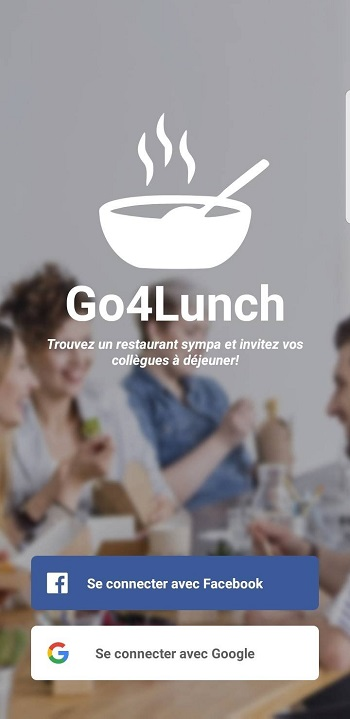
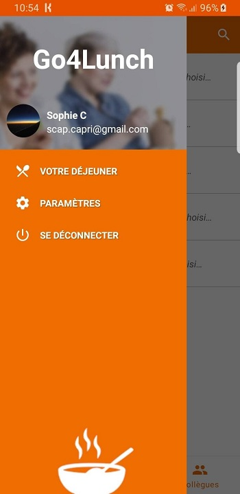
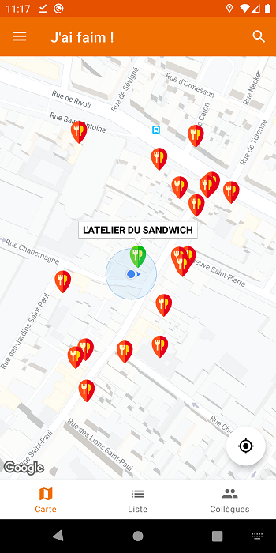
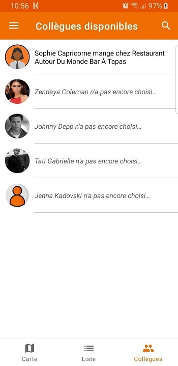
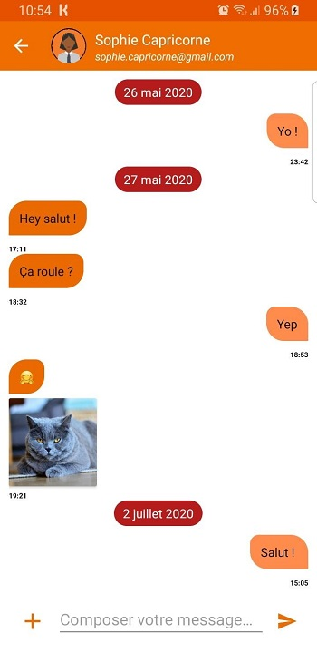
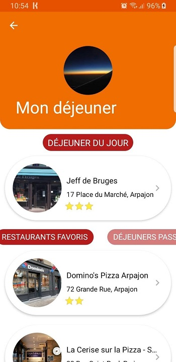

# **Projet Go4Lunch**
**P7 du parcours "Developpeur.euse d'Application Android" d'Openclassrooms**

L’application Go4Lunch est une application collaborative utilisée par les employés d'une entreprise.  
Elle permet de :
- Rechercher un restaurant dans les environs puis de sélectionner celui de  
son choix en en faisant part à ses collègues.
- Consulter les restaurants sélectionnés par les collègues afin de se joindre à eux.  
- Recevoir une notification un peu avant l’heure du déjeuner, pour rappeler à l'utilisateur le
  restaurant choisi ainsi que les collègues qui y déjeunent aussi.
- Rajouter des restaurants à ses favoris.
- Rechercher un restaurant à partir d'un nom

Bonus:
- Envoyer des messages à ses collègues.
- Voir l'historique des restaurants dans lesquels l'utilisateur a déjeuné.
- Rechercher un collègue à partir de son nom

## Screenshots
.

.
.
.

## Prerequis
**Obtenir le projet:**
Clicker sur "Clone or Download" en haut à droite du projet sur Github, télécharger et extraire
le fichier zip sur votre ordinateur.

**Logiciel nécessaire:**
Android Studio ([Comment installer Android Studio](https://developer.android.com/studio/install) )

Assurez vous d'installer un émulateur ou de configurer votre smartphone Android en mode développeur afin de pouvoir
lancer l'application.

## Lancer le projet

Pour pouvoir build le projet il vous faudra d'abord obtenir une clé API Google, une clé API Algolia
ainsi qu'un ID Algolia que vous inscrirez dans votre fichier "gradle.properties" avec les variables 
correspondantes :

- API_KEY=<votre clé>
- ALGOLIA_API_KEY=<votre clé>
- ALGOLIA_APP_ID=<votre ID> 

Vous aurez également besoin d'obtenir un fichier "google-services.json" à partir de
Firebase, à mettre dans le dossier "app".

Pour plus d'informations :
- https://firebase.google.com/docs/android/setup
- https://www.algolia.com

## Lancement des tests unitaires et UI

Vous trouverez les test unitaires dans le dossier "test" et les tests instrumentalisés
dans le dossier "androidTest".

**Lancer tous les tests d'une même classe:** Click droit sur le nom de la classe
et appuyez sur "Run 'NomDeLaClasse'".

**Lancer les tests un par un:** Click droit sur le nom de la méthode @Test que vous désirez lancer,
et appuyez sur ""Run 'NomDeLaMethode'".

## Librairies utilisees

- Firebase
- FirebaseUI
- Places
- Glide
- Retrofit
- WorkManager
- Algolia
- EasyPermissions
- Gson
- Espresso
- AndroidX

